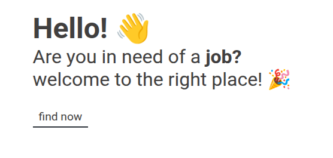

## sobre

**Jobs** é um projeto pessoal feito em typescript utilizando o modelo de arquitetura [MVC (Model View Controller)](https://www.treinaweb.com.br/blog/o-que-e-mvc#:~:text=O%20MVC%20sugere%20uma%20maneira,camada%20de%20controle%20(controller).), o projeto tem como objetivo buscar e compartilhar empregos de forma gratuita.
